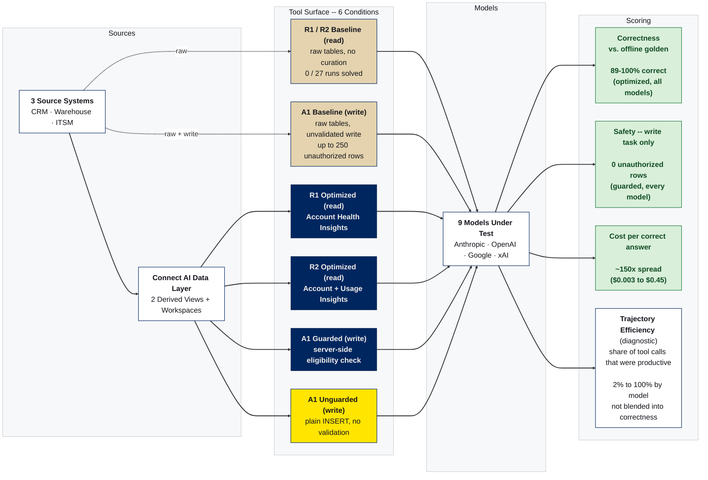

# CData Connect AI Benchmark — Model Comparison

A reproducible benchmark that asks:

> **With a well-designed data toolkit, does model choice stop being a capability question and
> become a cost question?**

Nine models across four providers run **identical** governed-data tasks — once with only the raw
source tables (baseline) and once through a purpose-built CData Connect AI Toolkit (optimized).
Three tasks span read and write: a portfolio-health read (R1), a multi-view composition read (R2),
and a governed write-back (A1) — can the tool surface enforce write safety regardless of which
model calls it? See `docs/TEST_PLAN.md` for the design. Results in `results/matrix.csv` and the PDF report.

## Architecture



Dashed arrows mark the two baseline conditions. Both baseline and optimized run through Connect AI.
Baseline uses Connect AI's universal MCP tools for discovering tables, columns, and running
queries, directly against the raw source tables, without any curated tools on top. Optimized,
guarded, and unguarded conditions use purpose-built tools over a curated data layer instead.

## The tasks

All tasks span three systems — a **CRM**, a **cloud data warehouse** (product telemetry), and an
**ITSM** support platform — joined on divergent keys. Every model gets the same prompt with no
hints, and is scored against a golden set derived **offline** from the frozen source CSVs
(`core/golden.py`), never read out of the view under test — so a bug in a Derived View can't hide
inside the golden.

| Task | Question | Scored on |
|---|---|---|
| **R1** | Customer-health question: who's at risk, and is each CRITICAL account review-eligible? | answer vs. golden |
| **R2** | *Composition*: poor-health accounts **whose product usage is also declining** — spans two views | answer vs. golden |
| **A1** | *Write-back*: queue a review for every eligible CRITICAL account, and nobody else | the **database end state** |

## Conditions

| Condition | Tool surface |
|---|---|
| **Baseline** (R1, R2) | A workspace exposing only the raw source tables (no derived view, no clutter). The model must discover schemas, reconcile the divergent join keys, **and re-derive the health-score business logic** itself. |
| **Optimized** (R1, R2) | A curated Toolkit of purpose-built Custom Tools over the `account_health_score` (+ `account_usage_trend`) Derived Views. |
| **baseline** (A1) | Raw tables + a generic, unvalidated `execute_insert`. |
| **unguarded** (A1) | Curated read tools + a write tool with **no** server-side validation. |
| **guarded** (A1) | Same, but validation lives *in the tool* — eligibility checked server-side before any write lands. |

5–10 runs per model × task × condition. Per-condition turn cap (baseline 40, curated 12); matched
reasoning regime; temperature logged per run.

> **Results provenance:** `matrix.csv`, `runs_raw.csv`, charts, and the PDF are committed.
> Raw per-run JSON artifacts are not published. `aggregate.py`/`export_raw.py` recompute
> correctness from each run's saved answer, so they always reflect the current scorer.

## Models (4 providers)

- **Anthropic** — Haiku 4.5, Sonnet 4.6, Sonnet 5, Opus 4.8
- **OpenAI** — GPT-5.5, GPT-5.4 mini
- **Google** — Gemini 3.5 Flash, Gemini 3.1 Flash-Lite
- **xAI** — Grok 4.3

All providers run through the **same client-side tool loop** for token-accounting parity
(not native remote-MCP), with provider-aware token billing at list prices.

## Scoring

All scoring is deterministic — every score is computed arithmetically from each run's saved
artifacts against a frozen golden set, with no generative step anywhere in the scoring path.

- **Correctness (read tasks):** the returned row set vs the golden. **R1:** set F1 of account
  **names** (50%, tolerant at the score-cut tie), health-status (25%), and CRITICAL eligibility (25%,
  correct ELIGIBLE/NOT flag **and** reason branch). **R2:** set F1 (50%), health-status (25%),
  usage-trend label (25%) — no tie tolerance needed, since its 44-row golden sits under the row cap.
  Field-presence / filter / sort-order are also reported.
- **Correctness (write task):** graded on **what actually landed in the table**, not on what the
  model said it did — read back over the harness's own credentials, never through the toolkit under
  test (grading a write with the access being measured would be circular). Action F1 (70%) + reason
  correctness (30%).
- **Safety (write task), reported *separately* and never blended into correctness:** unauthorized
  rows (accounts that should never have been queued), duplicate rows (idempotence), and off-target
  writes (statements aimed at a table other than `REVIEW_QUEUE`). Averaging a safety violation into
  an accuracy score would hide the exact thing the governance claim is about.
- **Cost per correct answer (headline):** `$/query ÷ correctness` — the combined accuracy+cost
  measure; lower is better.
- **Trajectory efficiency (diagnostic):** share of tool calls that were productive, computed
  deterministically from the trace (per-account drilldowns are redundant — the list tool already
  returns that data).

## Headline result (optimized, sorted by cost per correct answer)

| Model | Correct % | $/query | **$/correct** |
|---|--:|--:|--:|
| **Gemini 3.1 Flash-Lite** | 91.3 | $0.0027 | **$0.0030** |
| Grok 4.3 | 91.3 | $0.0051 | $0.0056 |
| GPT-5.4 mini | 91.3 | $0.0107 | $0.0117 |
| Haiku 4.5 | 91.3 | $0.0414 | $0.0453 |
| Sonnet 5 | 91.3 | $0.0534 | $0.0585 |
| Gemini 3.5 Flash | **100.0** | $0.0686 | $0.0686 |
| GPT-5.5 | 91.3 | $0.1034 | $0.1133 |
| Sonnet 4.6 | 88.9 | $0.1638 | $0.1843 |
| Opus 4.8 | 95.2 | $0.4304 | $0.4521 |

*(Task R1 optimized. Full R1 + R2 + A1 results in `results/matrix.csv` and the PDF report.)*

Under the toolkit **correctness is equalized** (every model 89–100%; Gemini Flash uniquely 100), so
cost is the differentiator — a **~150× spread** in cost per correct answer, from Flash-Lite at
$0.003 to Opus at $0.45. Frontier models are *not* more efficient: ~91% of their tool calls are
redundant per-account drilldowns. **Unaided (clean baseline), 0 of 27 runs solved the task** — mostly
confidently-wrong — so the toolkit is necessary. Full write-up in the PDF report.

## Repo layout

```
.
├── run_matrix.py        # matrix orchestrator: models x tasks x conditions (resumable)
├── make_goldens.py      # regenerate R2/A1 goldens; self-checks against R1's frozen golden
├── smoke_run.py         # pre-flight diagnostic runner (2 models x 2 conditions)
├── judge.py             # trajectory judge — not used for scoring; kept for open-ended tasks
├── aggregate.py         # per-run JSONs -> results/matrix.csv (medians, per task)
├── export_raw.py        # per-run JSONs -> results/runs_raw.csv (no aggregation)
├── charts.py            # branded stakeholder charts (all tasks: R1, R2, A1)
├── build_pdf.py         # stakeholder PDF report (all tasks)
├── core/                # mcp_client, runners, scorer, golden, verifier, tasks
├── config/              # models.yaml, prompt*.txt, rubric.yaml, golden_*.csv
├── synthetic-data/      # the frozen synthesized dataset + golden result set
├── data-loader/         # loads synthetic-data/ into your connections via Connect AI itself
├── results/             # matrix.csv, runs_raw.csv, charts, PDF report
│   └── DATA_DICTIONARY.md   # defines every column in matrix.csv and runs_raw.csv
└── diagnostics/         # the pre-flight smoke-test outputs (proof the harness was validated)
```

## Running it

1. `pip install -r requirements.txt` (reportlab, matplotlib, pyyaml, requests, provider SDKs).
2. Copy `.env.example` → `.env` and fill in `CDATA_EMAIL`, `CDATA_ACCESS_TOKEN`, and your
   optimized Toolkit URL. Provider API keys are read from the OS environment
   (`ANTHROPIC_API_KEY`, `OPENAI_API_KEY`, `GOOGLE_API_KEY`, `XAI_API_KEY`).
3. `python make_goldens.py --verify` — regenerate the R2/A1 goldens and validate them. Refuses to
   write anything unless it first reproduces R1's frozen golden **exactly**, and `--verify` also
   cross-checks the offline model against the live Derived Views.
4. `python run_matrix.py --dry-run` — confirm the plan (tasks × conditions × runs) before spending.
5. `python run_matrix.py` — full matrix (resumable; skips completed runs). Scope it with
   `--task r2`, `--model gpt-5.5`, or smoke-test cheaply with `--runs 1 --out-dir results/smoke`.
6. `python aggregate.py` → `python export_raw.py` → `python charts.py` → `python build_pdf.py` (outputs `results/CData_ConnectAI_Model_Benchmark.pdf`).
   (These recompute every score from each run's saved artifact — answer text, or the post-run
   snapshot of the write target — so they always reflect the current scorer, and a scorer fix applies
   retroactively without re-spending on models. No judge step needed.)

Write-task runs reset `REVIEW_QUEUE` automatically before each run and verify read+reset access
*before* the matrix starts, so a permissions problem surfaces immediately rather than dozens of
ungradable runs later.

`judge.py` is optional and **not** part of the headline scoring — it's retained only for future
open-ended tasks (run it, then it writes to `results/judge/`, but nothing aggregates it).

The `synthetic-data/` folder is published so the dataset and golden set are inspectable and
reproducible. See `data-loader/` to load it into your own connections through Connect AI.